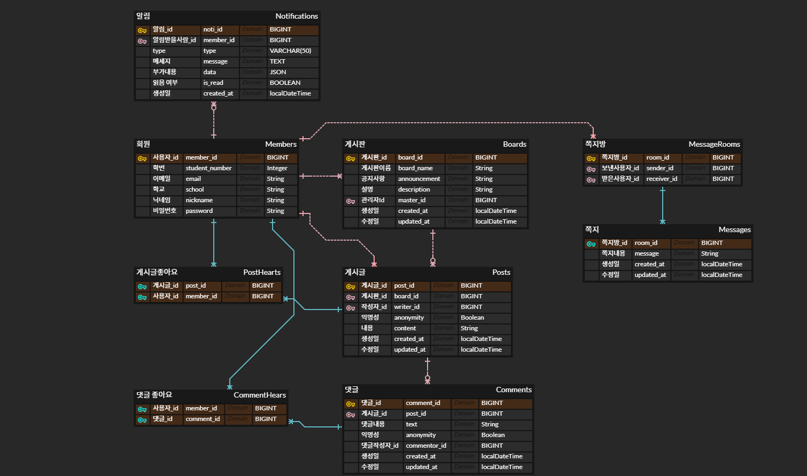

# efub5-backend-assignment
💙 이펍 5기 백엔드 인턴 과제 제출 레포지토리
**********
## 3주차
### API 명세 마무리 && ERD 작성
- API 명세  
[api 명세 링크](https://m2nsp.gitbook.io/m2nsp/everytime)
- ERD  
  
[erd 링크](https://www.erdcloud.com/d/CxvS2pMFYYod7CuC2)

**********
## 4주차
### member CRUD 구현

